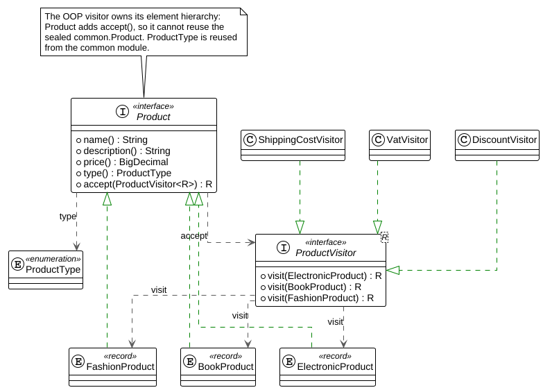
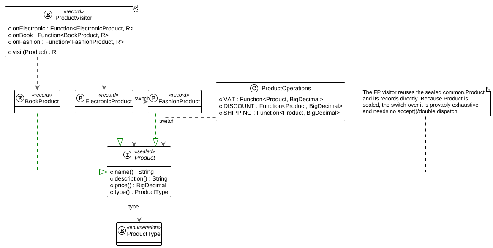
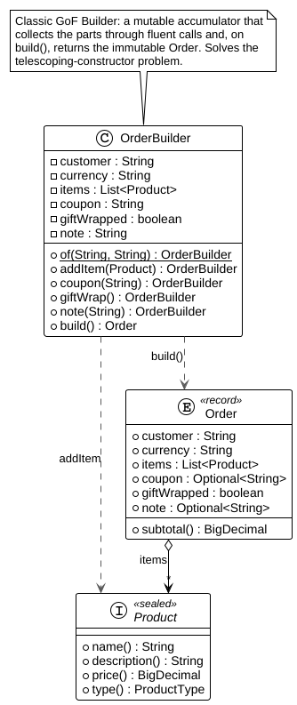
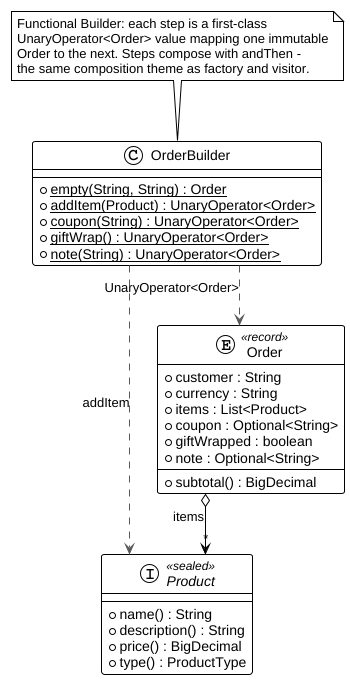
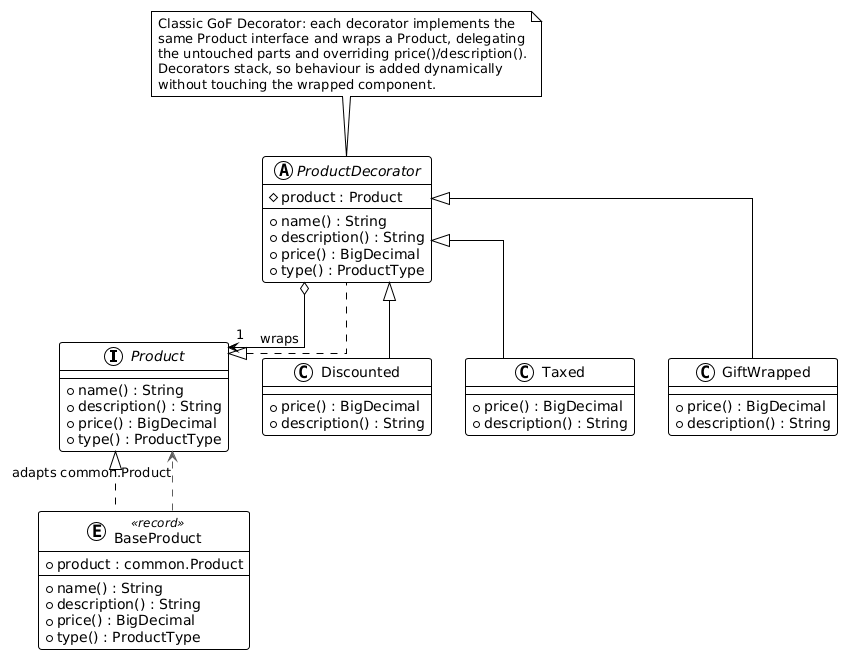
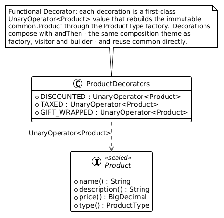

# Rethinking Java Design Patterns: from OOP to FP

Functional Programming answer, to those who wonder how to integrate or combine 
it with Object-Oriented Programming, is usually: *Turtles all the way down*.

This is an aphorism which origin is credited to Richard Feynman. In his book,
*Surely You're Joking, Mr. Feynman !*, published in 1985, he tells the story 
of one of his conferences on the nature on the universe, where he has been challenged
by someone in the audience, saying that the universe rests on a turtle. Feynman
asked then what the turtle is resting on and the answer was: "another bigger turtle".
And when he smugly asked what the bigger turtle is resting on, the attendee said:
"It's turtles all the way down, you can't trick me !"

This metaphor is often used in the context of the Functional Programming to describe
an infinite series of entities governed by a recursive principle. And it's also
the answer of the Functional Programming to developers coming from an Object-Oriented
mindset: "just do functional all the way down". But, in order to adopt a more systematic
approach of combining object-oriented principles in a functional style, a more 
practical answer is required and this is what I'm trying to do here.

We, as developers, fortunatelly don't have to reinvent the wheel. All the problems
are solved nowadays, especially since the LLM agents became the most common 
digital infrastructure. But as surprizing as it might seem to our younger 
colleagues, who can't live 48 hours without AI, even before LLMs, a general 
approach fitting solutions to problems existed, in the form of design patterns.

As a matter of fact, the Object-Oriented Programming proposes repeatable solutions
tested, proven and formalized, called design patterns, that you most likely already
used, even if you aren't mandatory aware that you did.

The *Gang of Four* classified these patterns in three groups:

  - *Behavioral patterns* which deal with responsibilities and communication between objects.
  - *Creational patterns* that abstract the objects creation / instantiation process.
  - *Structural patterns* that compose objects such that to form larger or enhanced ones.

Let's take one of the most commonly used patterns in each category and see how 
to combine their object-oriented inherent nature to a more functional approach.

## The Factory

This design pattern belongs to the creational category and its purpose is to 
instantiate objects without exposing implementation details.

### The object-oriented approach

The figure below shows the class diagram of a factory design pattern:

Our scenario here is a simple one: a `Product` interface implemented by three 
classes: `BookProduct`, `ElectronicProduct` and `FashionProduct`. They can be 
created through the `ProductFactory` class, as follows:

    public class ProductFactory
    {
      public static Product newProduct (String name, String description, BigDecimal price, ProductType productType)
      {
        Objects.requireNonNull(name, "Name is null");
        ...
        return switch (productType)
        {
          case BOOK -> new BookProduct(name, description, price);
          case ELECTRONIC -> new ElectronicProduct(name, description, price);
          case FASHION -> new FashionProduct(name, description, price);
          default -> throw new IllegalArgumentException ("Unknown type: %s".formatted(productType));
        };
      }
    }

Using this factory, it's very easy to create a `BookProduct`, for example, while
avoiding to expose implementation details:

        ...
        Product product = ProductFactory.newProduct("Book1", "A book",
          new BigDecimal("20.50"), ProductType.BOOK);
        ...

As you probably noticed, the `ProductType` enumerated defines the three categories.
If a new product is to be introduced, the factory has to be modified such that to
reflect this business changement. And this interdependence of the factory and the
enumerated makes the whole approach fragile.

In order to reduce this fragility, we need to introduce a compile-time validation 
with a more functional approach.

### The functional approach

Our example is an over-simplified case of a product management system. The presented
factory instantiate different simple records having the same arguments. These 
identical constructors give us the possibility to move the factory directly into
the `ProductType` enumerated, such that any new product automatically requires 
a correspondent factory.

Java `enum` types are based on constant names, but we can attach to each one its 
correspondent value. Or, even better, a factory function for creating discrete 
products. Look at that:

    public enum ProductType
    {
      ELECTRONIC(ElectronicProduct::new),
      FASHION(FashionProduct::new),
      BOOK(BookProduct::new);

      public final TriFunction<String, String, BigDecimal, Product> factory;

      ProductType (TriFunction<String, String, BigDecimal, Product> factory)
      {
        this.factory = factory;
      }

      public Product newInstance (String name, String description, BigDecimal price)
      {
        Objects.requireNonNull(name, "Name is null");
        ...
        return this.factory.apply (name, description, price);
      }
    }

Now, creating a new `Product` instance is easier:

    Product product = ProductType.BOOK.newInstance("Book1",
      "A book", new BigDecimal("20.45"));

The public property `factory` seems redundant now that a dedicated method for the
instance creation is available. But it provides a very convenient functional way
to interact further with the factory. For example:

    ProductType.BOOK.factory.andThen(showThePrice).apply("Book1",
      "A book", new BigDecimal("20.45"));

as shown in the `TestProductFactory` class, in the `fp_design_paterns.factory` 
package. Of course, given that our products need three arguments constructors and
since Java doesn't provide an equivalent of the `BiFunction` class, but with three
input arguments, you will need to craft a `TriFunction` class, as shown below:

    @FunctionalInterface
    public interface TriFunction<A, B, C, R>
    {
      R apply(A a, B b, C c);
      default <K> TriFunction<A, B, C, K> andThen(Function<? super R, ? extends K> f) 
      {
        Objects.requireNonNull(f);
        return (A a, B b, C c) -> f.apply(apply(a, b, c));
      }
    }

You can do that or, if like me, you prefer to use a reliable library, then Vavr
already defines a `Function3` interface that has the behavior you want. Just 
include the following Maven dependency:

    <dependency>
      <groupId>io.vavr</groupId>
      <artifactId>vavr</artifactId>
      <version>1.0.1</version>
    </dependency>

This library is the good choice if you need to define functions with up to 8 
arguments. Then, you just need to replace, in `ProductType`, the following
definition:

    public final TriFunction<String, String, BigDecimal, Product> factory;

    ProductType (TriFunction<String, String, BigDecimal, Product> factory)
    {
      this.factory = factory;
    }

bvy this one:

    public final Function3<String, String, BigDecimal, Product> factory;

    ProductType (Function3<String, String, BigDecimal, Product> factory)
    {
      this.factory = factory;
    }

## The Visitor

This design pattern belongs to the behavioral category and its purpose is to 
add new operations to an existing object hierarchy without modifying the classes 
of that hierarchy. It is the classic answer to the *expression problem*: when the 
set of types is stable but the set of operations grows, the Visitor lets you keep 
adding operations cheaply.

We reuse the same domain as the factory: a `Product` implemented by `BookProduct`, 
`ElectronicProduct` and `FashionProduct`. To give the visitor a reason to exist, 
each operation now behaves differently per product type:

  - **VAT**: a reduced 5.5% rate for books, the standard 20% rate otherwise.
  - **Shipping**: `10.00 + 2%` of the price for (fragile, insured) electronics, a 
    flat `3.00` for books and a flat `5.00` for fashion.
  - **Discount**: 10% for electronics, 5% for books, 15% for fashion.

### The object-oriented approach

The classic Visitor relies on *double dispatch*. Each `Product` accepts a visitor 
and calls back the overload matching its own type:

    public interface Product
    {
      ...
      <R> R accept(ProductVisitor<R> visitor);
    }

    public record BookProduct (String name, String description, BigDecimal price) implements Product
    {
      ...
      public <R> R accept(ProductVisitor<R> visitor)
      {
        return visitor.visit(this);
      }
    }

The operation lives in a generic visitor, one `visit` overload per concrete type:

    public interface ProductVisitor<R>
    {
      R visit(ElectronicProduct product);
      R visit(BookProduct product);
      R visit(FashionProduct product);
    }

Computing the VAT of any product is then a matter of applying a concrete visitor:

    BigDecimal vat = book.accept(new VatVisitor());

Adding a new operation (shipping, discount, ...) only requires a new 
`ProductVisitor` implementation - the `Product` classes never change. This is the 
reverse of the trade-off the factory made: the factory made adding a new 
*operation* easy but a new *product type* costly (you must edit its central 
`switch`); the visitor makes adding a new *operation* free but shifts that same 
cost onto types - a new product type now forces **every** visitor to be updated. 
It is the classic *expression problem*: you can make types cheap to add or 
operations cheap to add, but not both.

The following figure below shows the object-oriented implementation class diagram:

### The functional approach

Look now at the class diagram of the Vistor functional style implemntation:

In modern Java the functional counterpart of the Visitor is **exhaustive pattern 
matching over a sealed type**. We first seal the hierarchy:

    public sealed interface Product permits ElectronicProduct, BookProduct, FashionProduct
    {
      ...
    }

An operation is then just a `Function<Product, R>` built on a `switch` that 
deconstructs each record. Because `Product` is sealed, the compiler proves the 
switch is exhaustive - no `default` branch, no double dispatch, no `accept`:

    public static final Function<Product, BigDecimal> VAT = product -> switch (product)
    {
      case BookProduct(String name, String description, BigDecimal price) -> amount(price, "0.055");
      case ElectronicProduct(String name, String description, BigDecimal price) -> amount(price, "0.20");
      case FashionProduct(String name, String description, BigDecimal price) -> amount(price, "0.20");
    };

Being ordinary functions, these operations compose:

    ProductOperations.DISCOUNT.andThen(amount -> "discount=" + amount).apply(fashion);

Between the classic Visitor and pure pattern matching sits an intermediate step: 
the visitor as a *bundle of functions*, one lambda per type, instead of an 
interface with one method per type:

    public record ProductVisitor<R>(
      Function<ElectronicProduct, R> onElectronic,
      Function<BookProduct, R> onBook,
      Function<FashionProduct, R> onFashion)
    {
      public R visit(Product product)
      {
        return switch (product)
        {
          case ElectronicProduct e -> onElectronic.apply(e);
          case BookProduct b -> onBook.apply(b);
          case FashionProduct f -> onFashion.apply(f);
        };
      }
    }

Which makes an operation a value you can assemble on the fly:

    ProductVisitor<BigDecimal> vat = new ProductVisitor<>(
      e -> ..., b -> ..., f -> ...);
    BigDecimal amount = vat.visit(book);

## The Builder

This design pattern belongs to the creational category, like the factory, but it
solves a different problem. The factory hides *which* concrete type gets
instantiated while the Builder assembles a single, complex object step by step,
separating its construction from its representation. It is the classic answer to
the *telescoping-constructor problem*: an object with many parameters, among which some
required, most optional, whose constructor would otherwise explode into a
combinatorial set of overloads.

Our `Product` records have only three required fields, so they don't motivate a
builder. We therefore introduce an `Order`: a customer order that aggregates the
`common` products as line items and adds several optional attributes - a coupon
code, a gift-wrap flag and a free-text note. Whatever the style, the target is the
same immutable value:

    public record Order(
      String customer,
      String currency,
      List<Product> items,
      Optional<String> coupon,
      boolean giftWrapped,
      Optional<String> note)
    {
      public Order
      {
        Objects.requireNonNull(customer, "Customer is null");
        Objects.requireNonNull(currency, "Currency is null");
        items = items == null ? List.of() : List.copyOf(items);
        coupon = coupon == null ? Optional.empty() : coupon;
        note = note == null ? Optional.empty() : note;
      }

      public BigDecimal subtotal() { ... }
    }

### The object-oriented approach

The figure below shows the class diagram of the object-oriented builder:

The classic *Gang of Four* Builder is a mutable accumulator. The required
arguments are captured up front, the optional ones are added through fluent calls
that all return `this`, and `build()` freezes the accumulated state into the
immutable `Order`:

    public final class OrderBuilder
    {
      private final String customer;
      private final String currency;
      private final List<Product> items = new ArrayList<>();
      private String coupon;
      private boolean giftWrapped;
      private String note;

      public static OrderBuilder of(String customer, String currency) { ... }

      public OrderBuilder addItem(Product item) { items.add(item); return this; }
      public OrderBuilder coupon(String coupon) { this.coupon = coupon; return this; }
      public OrderBuilder giftWrap() { this.giftWrapped = true; return this; }
      public OrderBuilder note(String note) { this.note = note; return this; }

      public Order build()
      {
        return new Order(customer, currency, items,
          Optional.ofNullable(coupon), giftWrapped, Optional.ofNullable(note));
      }
    }

Building an order reads as a sentence, and you only mention the parts you actually
need:

    Order order = OrderBuilder.of("Alice", "EUR")
      .addItem(book).addItem(phone)
      .coupon("SUMMER").giftWrap()
      .build();

### The functional approach

Look now at the class diagram of the functional style implementation:

The functional counterpart keeps the same immutable `Order` target but drops the
mutable accumulator. Each build step becomes a first-class
`UnaryOperator<Order>` value - a pure function mapping one immutable `Order` to
the next by returning a modified copy:

    public static UnaryOperator<Order> addItem(Product item)
    {
      return order -> new Order(order.customer(), order.currency(),
        Stream.concat(order.items().stream(), Stream.of(item)).toList(),
        order.coupon(), order.giftWrapped(), order.note());
    }

Because the steps are ordinary values, they are not called *on* a builder, but they
are composed with `andThen`, exactly as the factory composed its `factory`
function and the visitor composed its operations:

    Function<Order, Order> config = addItem(book)
      .andThen(addItem(phone))
      .andThen(coupon("SUMMER"))
      .andThen(giftWrap());

    Order order = config.apply(OrderBuilder.empty("Alice", "EUR"));

This is more than a stylistic variation. In the OOP version a step is a method
call that exists only for the duration of the chain. In the FP version a step is
a value which can be stored it in a variable, passed to another method, kept in a
list of steps and applied later, or reused the very same step twice:

    UnaryOperator<Order> addBook = addItem(book);
    Order order = addBook.andThen(addBook).apply(OrderBuilder.empty("Alice", "EUR"));

The object-oriented Builder wraps a stateful object around the immutable target
while the functional one expresses construction as the composition of pure copy
functions over it. "Turtles all the way down", and both land on the same `Order`.

## The Decorator

This design pattern belongs to the structural category and its purpose is to
attach additional responsibilities to an object dynamically, by wrapping it in
another object that shares the same interface. It is the flexible alternative to
subclassing for extending behavior: rather than a combinatorial explosion of
`DiscountedTaxedGiftWrappedProduct` subclasses, you wrap a product in as many
independent decorators as you need, and they stack.

We reuse the same `Product` domain. Each decorator changes the `price()` and the
`description()` while leaving everything else untouched. To keep the pattern
visibly distinct from the visitor, whose rules varied per product type, the
decorators here apply the same rule to every product:

  - Discounted: 10% off the wrapped price.
  - Taxed: adds 20% VAT to the wrapped price.
  - GiftWrapped: adds a flat `5.00` wrapping fee.

Because they stack, a 100.00 book decorated `Discounted` → `Taxed` →
`GiftWrapped` goes `100.00 → 90.00 → 108.00 → 113.00`, and its description reads
`"A book (discounted) (VAT incl.) (gift-wrapped)"`.

### The object-oriented approach

The figure below shows the class diagram of the object-oriented decorator:

The classic *Gang of Four* Decorator is an object that implements the component
interface and holds a reference to another component, delegating the untouched
operations and overriding the ones it enhances. An abstract `ProductDecorator`
captures the delegation once:

    public abstract class ProductDecorator implements Product
    {
      protected final Product product;

      protected ProductDecorator(Product product)
      {
        this.product = Objects.requireNonNull(product, "Product is null");
      }

      public String name() { return product.name(); }
      public String description() { return product.description(); }
      public BigDecimal price() { return product.price(); }
      public ProductType type() { return product.type(); }
    }

Each concrete decorator then overrides only what it changes:

    public class Discounted extends ProductDecorator
    {
      private static final BigDecimal RATE = new BigDecimal("0.10");

      public Discounted(Product product) { super(product); }

      public BigDecimal price()
      {
        return product.price().subtract(amount(product.price(), RATE));
      }

      public String description()
      {
        return product.description() + " (discounted)";
      }
    }

Since a decorator is a `Product`, decorators wrap decorators and the enhancements
compose by nesting:

    Product wrapped = new GiftWrapped(new Taxed(new Discounted(new BaseProduct(book))));
    BigDecimal price = wrapped.price();   // 113.00

The leaf being wrapped is a `BaseProduct`, a small record that adapts a shared
`common.Product` into the decorator's own interface. This is necessary because
`common.Product` is `sealed` and so, exactly like the object-oriented visitor, the
decorator cannot make the `common` records implement its interface directly.

### The functional approach

Look now at the class diagram of the functional style implementation:

The functional counterpart of a decorator is simply a function whicg maps a product
to an enhanced product and implemented as an `UnaryOperator<Product>`. Because 
the `common` records are immutable, "enhancing" one means rebuilding it through
the `ProductType` factory, already seen at the very beginning, which is why the
FP side reuses `common` directly with no adapter:

    public static final UnaryOperator<Product> DISCOUNTED = product ->
      product.type().newInstance(product.name(),
        product.description() + " (discounted)",
        product.price().subtract(amount(product.price(), "0.10")));

Being ordinary values, the decorations compose with `andThen`, exactly as the
factory composed its `factory` function, the visitor composed its operations and
the builder composed its steps:

    UnaryOperator<Product> decorate = DISCOUNTED.andThen(TAXED).andThen(GIFT_WRAPPED);
    Product wrapped = decorate.apply(book);   // price 113.00

And, just like the functional builder step, a decoration is a reusable first-class
value. For example, the same discount could be applied twice:

    Product wrapped = DISCOUNTED.andThen(DISCOUNTED).apply(book);   // 100 -> 90 -> 81

The object-oriented Decorator wraps the component in a stack of objects sharing its
interface, while the functional one expresses the very same stacking as the
composition of pure `Product` to `Product` functions. "Turtles all the way down",
and both land on the same enhanced product.

## Project structure

The code is organized as a multi-module Maven project. The product domain lives
in its own `common` module: a `sealed` `Product` interface, the three product
records and the `ProductType` enumerated which already carries the FP factory
function seen above. Everything that can reuse that domain does:

    oop-fp-design-patterns        (parent POM)
    ├── common                    sealed Product, the records, ProductType(+factory)
    ├── factory   (→ common)      ProductFactory (OOP); the FP factory *is* common.ProductType
    ├── visitor   (→ common)      FP: operations over the common records (switch + lambda bundle)
    │                             OOP: its own element hierarchy (see below)
    ├── builder   (→ common)      immutable Order over the common records; OOP: fluent
    │                             OrderBuilder; FP: composed UnaryOperator<Order> steps
    └── decorator (→ common)      FP: composed UnaryOperator<Product> decorations over the
                                  common records; OOP: its own Product interface (see below)

The FP factory, the FP visitor and the FP decorator all operate directly on the
`common` records, so nothing is duplicated there. The two exceptions are the
object-oriented Visitor and the object-oriented Decorator. The Visitor needs an
`accept` method on every element (double dispatch); the Decorator needs a
non-sealed `Product` interface that its wrappers can implement. In both cases
`common.Product` is `sealed` and cannot be extended from another module, so each
owns its own element/component types and reuses only the `ProductType` enumerated -
the OOP decorator bridges back to `common` through a small `BaseProduct` adapter.
This asymmetry is not accidental. The classic Visitor requires every element to
expose an `accept` method and the classic Decorator requires every component to
share the wrappers' interface; both couple the elements to the pattern's
abstraction, so they cannot be the sealed records defined in `common`. The
functional approach has no such coupling: it operates over the sealed type from the
outside - pattern-matching for the visitor, rebuilding through the factory for the
decorator - so the elements know nothing about the operations applied to them and,
hence, can be the shared `common` records.

The full code of these examples, including the associated unit tests, 
can be found here.